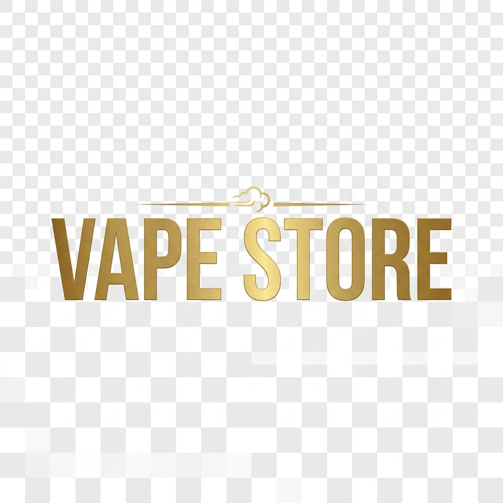

# VapeCulture Kenya 🌿💨

<div align="center">
  
  <h3>Kenya's Most Trusted Vape Store &mdash; Storefront Showcase</h3>
  <p><strong>A full-stack static storefront export of <a href="https://vapecultureke.com">VapeCultureKE</a></strong></p>
  <p>Featuring a complete product catalogue, interactive slide-out cart drawer, instant client-side search &amp; filter, authentic product galleries, and complete local asset mirror.</p>
</div>

---

## 📸 Screenshots

### 🏠 Storefront Homepage & Hero


### 🛍️ Product Catalog & Filter Grid


### 📦 Product Detail View (Yuoto XXL)


---

## ⚡ Key Features (Senior Developer Overhaul)

- **🎨 Modern Luxury Dark UI:** Built with custom CSS custom properties, smooth transitions, glassmorphic header, and glowing neon accents.
- **🏷️ Brand Identity:** Official VapeCulture Kenya logo integrated across all headers, footers, and brand badges.
- **🔍 Instant Client-Side Search:** Real-time fuzzy filtering of product cards without full page reload.
- **🛒 Interactive Cart Drawer:** Slide-out drawer with quantity controls (`+` / `-`), auto-updating subtotals, item counter badge, and checkout simulation.
- **📱 Fully Responsive:** Adaptive layouts optimized for mobile, tablet, and widescreen desktop monitors.
- **🚀 Fixed Asset Pipelines:** Resolved broken `srcset` attributes and domain placeholders across 900+ mirrored HTML pages for seamless offline viewing.
- **🛡️ Trust & Compliance:** Verification badges, age restrictions ("Strictly 18+ Only"), and Kenya M-PESA payment integration prompts.

---

## 📁 Repository Structure

```
VapeCulture/
├── index.html                  # Root entry-point with instant storefront redirection
├── logo.png                    # High-resolution brand logo (1024x1024)
├── serve.py                    # Local development server (Python http.server)
├── fix_placeholders.py         # Asset and domain placeholder normalization script
├── screenshots/                # Visual documentation screenshots
│   ├── homepage.jpg
│   ├── collections.jpg
│   └── product-page.jpg
├── vapeculture.in/             # Core mirrored storefront
│   ├── index.html              # Enhanced senior-developer storefront homepage
│   ├── logo.png                # Storefront brand logo
│   ├── collections/            # Category collections (All, Disposables, Pods, Nic Salts, etc.)
│   ├── products/               # Individual product detail pages
│   ├── pages/                  # Static brand and informational pages
│   ├── cdn/                    # Local CSS, JavaScript modules, fonts, and product images
│   └── cart.html               # Dedicated cart view
├── cdn.shopify.com/            # Mirrored CDN styles, modules & fonts
├── judgeme.imgix.net/          # Review & rating badges
└── customer-first-focus.b-cdn.net/ # Enhanced loader assets
```

---

## 🚀 How to Run Locally

### 1. Launch with Python Local Server (Recommended)
From the project root:
```bash
python serve.py
```
Then open your browser to **[http://localhost:8080](http://localhost:8080)**.

### 2. Direct File Browsing
You can also directly open `vapeculture.in/index.html` or root `index.html` in any modern web browser (Google Chrome, Microsoft Edge, Firefox, Safari).

---

## 🛒 Product Categories Available

| Category | Featured Brands & Hardware |
|---|---|
| **Disposable Vapes** | Yuoto (XXL, Thanos, Lens), Elf Bar (Pi9000), Air Bar, Adalya |
| **Pod Systems** | Voopoo Argus Z, Vladdin RE, Uwell Caliburn, RELX Infinity |
| **Nicotine Salts** | Naked 100, BLVK Unicorn, I Love Salts (30ml, 25mg - 50mg) |
| **IQOS & HEETS** | Philip Morris IQOS sticks (Bronze, Amber, Sienna, Turquoise) |
| **Nicotine Pouches** | VELO, ZYN, White Fox, Lyft |

---

## 🛠️ Tech Stack

- **Markup & Styling:** Semantic HTML5, Modern CSS3 (Grid, Flexbox, CSS Variables, Glassmorphism)
- **Scripting:** Modern Vanilla JavaScript (ES6+)
- **Server:** Python 3 Built-in HTTP Server (`serve.py`)
- **Origin Platform:** Shopify Dawn Theme Architecture

---

<div align="center">
  <sub>Built &amp; maintained by <strong>Tonnybraxton</strong> &bull; For developer portfolio and demonstration purposes.</sub>
</div>
